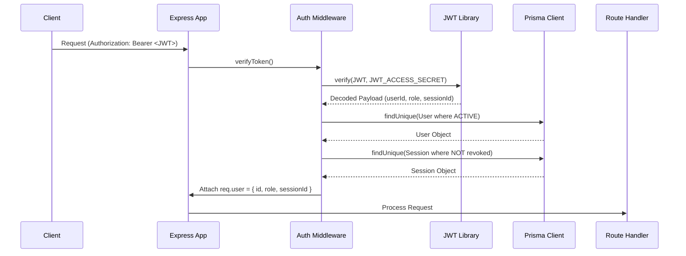

# Phase 2 Completion: Middleware And Infrastructure

Phase 2 adds the core request processing, security, validation, logging, and helper infrastructure to the Neargrab backend. Inline middlewares have been extracted and refactored into focused, testable middleware modules.

## Files Added

- `src/middleware/request-id.middleware.js`
- `src/middleware/request-id.middleware.test.js`
- `src/middleware/security.middleware.js`
- `src/middleware/security.middleware.test.js`
- `src/middleware/logger.middleware.js`
- `src/middleware/logger.middleware.test.js`
- `src/middleware/auth.middleware.js`
- `src/middleware/auth.middleware.test.js`
- `src/middleware/role.middleware.js`
- `src/middleware/role.middleware.test.js`
- `src/middleware/validate.middleware.js`
- `src/middleware/validate.middleware.test.js`
- `src/middleware/upload.middleware.js`
- `src/middleware/upload.middleware.test.js`
- `src/middleware/not-found.middleware.js`
- `src/middleware/error.middleware.js`
- `src/middleware/error.middleware.test.js`
- `src/lib/pagination.js`
- `src/lib/pagination.test.js`
- `src/lib/transaction.js`
- `src/lib/transaction.test.js`

## Middleware Behavior

### 1. Request ID Middleware
Reads `x-request-id` from incoming request headers or generates a random UUID using `crypto.randomUUID()`. Attaches the value to `req.id` and sets the `x-request-id` header in the response.

### 2. Security Middleware
- **Helmet**: Adds standard HTTP security headers.
- **CORS**: Validates incoming request origin against `env.CORS_ORIGINS`. Allows requests with no origin (e.g. mobile/CURL) and rejects disallowed origins with a 403 `FORBIDDEN` error.
- **JSON & URL-encoded Parsers**: Standardizes request body parsing with size safety (1MB limit).
- **Rate Limiting**: Exposes `createRateLimiter()` utilizing `express-rate-limit` to return 429 `RATE_LIMITED` errors. Exposes pre-configured limiters for general API routes (`generalLimiter`), auth routes (`authLimiter`), and OTP request routes (`otpLimiter`). Limiters automatically skip blocking in `NODE_ENV=test`.

### 3. Pino Request Logging
Uses structured JSON logging via `pino-http` bound to the main pino instance in `src/config/logger.js`. Attaches `req.id` to every request log and auto-suppresses logs during test execution to ensure a clean console.

### 4. Auth & Optional Auth Middleware
- `authenticate(req, res, next)`: Extracts bearer token from `Authorization` header, validates signature and expiration, and performs database queries to ensure the corresponding User is `ACTIVE` and the Session is not revoked. Attaches the normalized session context `req.user = { id, role, sessionId }`. Rejects requests with 401 `UNAUTHENTICATED` on invalid tokens or DB status checks.
- `optionalAuth(req, res, next)`: Decodes/verifies the token similarly, but if no token or an invalid token is provided, it simply sets `req.user = null` and proceeds without blocking.

### 5. Role and Permission Middleware
- `requireRole(...roles)`: Blocks requests with 403 `FORBIDDEN` if the user's role does not match the allowed roles list.
- `requireAdminPermission(permission)`: Checks if the admin user's role is granted the requested permission via the `AdminPermission` table in the database. `SUPER_ADMIN` is automatically granted all permissions.

### 6. Zod Validation Middleware
- `validate({ body, query, params })`: Runs schemas against the requested request segments, sanitizing values and transforming coerced fields (such as strings to numbers). Rejects invalid segments with a 400 `VALIDATION_ERROR` detailing the specific field failures.

### 7. Upload Middleware
Sets up a disk storage engine pointing to the upload directory.
- `uploadSingle(fieldName)`: Middleware to upload a single file.
- `uploadMany(fieldName, maxCount)`: Middleware to upload multiple files.
Validates sizes against the config limit and restricts MIME types to images (`png, jpg, jpeg, webp`) and documents (`pdf`).

### 8. NotFound and Error Handling Middlewares
- **NotFound**: Captures unhandled routing failures and forwards a 404 `NOT_FOUND` error.
- **ErrorHandler**: Normalizes thrown errors (JWT signature failures, Multer storage constraints, JSON SyntaxErrors, Zod validation errors, custom AppErrors) to the uniform response structure. Under non-production configurations, the middleware retains the internal error stacks and messages for ease of debugging.

## Environment Variables Added

The following properties were added to `.env.example` and validated inside `src/config/env.js`:
- `UPLOAD_MAX_FILE_SIZE_BYTES`: Max size limit for Multer file uploads (default 5MB).
- `RATE_LIMIT_WINDOW_MS`: Time duration for tracking rate limit windows (default 1 minute).
- `RATE_LIMIT_MAX`: Max requests allowed per window (default 100).
- `LOG_LEVEL`: Default level for pino logging output (default `info`).

## Authentication Context Flow

## Known Limitations

- **Authentication Services**: Full sign-up, session creation, token rotation, and refresh handlers are not built yet. They will be completed in Phase 3.
- **Media Assets Database Storage**: Uploads currently store files on local disks. Relational media records and external cloud providers (S3/R2/Cloudinary) will be integrated in Phase 10.
